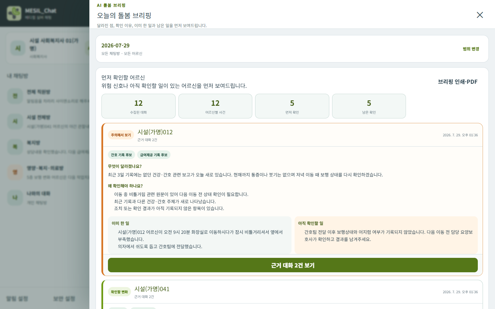

# MESIL_Chat — AI 돌봄 브리핑

> **대화는 입력이고, 돌봄 브리핑이 결과입니다.**

MESIL_Chat(메실챗)은 요양현장의 채팅·음성·손글씨·사진 보고를 어르신별 변화,
이미 한 일, 아직 확인할 일, 기록 활용 후보로 정리하고 모든 판단을 원문 근거로
다시 확인할 수 있게 하는 AI 업무지원 프로토타입입니다.

**[3분 심사위원 체험](https://chat.silvermedical.kr/reviewer)**
· [체험 안내](docs/24_JUDGE_EXPERIENCE_GUIDE.md)

> 모든 직원과 어르신은 가명입니다. 실제 개인정보를 입력하지 마세요.



## 10초 안에 답하는 네 가지

| 현장에서 필요한 질문 | MESIL_Chat이 보여주는 결과 |
|---|---|
| 오늘 평소와 달라진 어르신은 누구인가? | 변화·위험 신호와 아직 끝나지 않은 확인을 기준으로 먼저 볼 대상을 표시합니다. |
| 왜 확인이 필요한가? | 근거가 된 관찰과 최근 변화 이유를 함께 보여줍니다. |
| 이미 무엇을 했고, 아직 하지 않은 것은 무엇인가? | 시행한 조치와 남은 확인을 분리합니다. |
| 어떤 기록에 활용할 수 있는가? | 간호·급여제공·상담·프로그램 등 기록 활용 후보와 근거 원문을 연결합니다. |

AI는 진단, 공식 평가점수, 공식 기록을 자동 확정하지 않습니다. 담당자가 근거
원문을 보고 수정·확인한 뒤 사용합니다.

## 3분 체험

별도의 아이디나 비밀번호를 공개하지 않습니다. 심사위원 전용 화면에서 역할
버튼을 누르면 기간제 가명 체험 세션이 열립니다.

1. **요양보호사로 체험하기**
   글·음성·손글씨·사진 보고와 읽음·답글을 확인합니다.
2. **사회복지사로 체험하기**
   `AI 돌봄 브리핑`에서 먼저 확인할 어르신, 이유, 이미 한 일과 남은 일을 봅니다.
3. **원문과 기록 활용 확인**
   근거 대화를 같은 자리에서 펼치고, 필요한 근거만 골라 AI 정리 결과를 확인합니다.

심사 체험 중 작성한 가명 메시지는 다른 심사위원에게도 보일 수 있습니다.
실제 개인정보는 입력하지 마세요.

## AI 처리 흐름

```text
채팅·사진·손글씨·음성
  → Qwen3-VL 8B 이미지 판독 / Whisper Small 음성 받아쓰기
  → 어르신·사건·조치·미완료 확인을 근거 중심으로 묶기
  → 빠른 규칙 기반 돌봄 브리핑
  → Nemotron 3 Ultra 550B 우선 AI 정리
  → Qwen 3.6 35B · Gemma 4 e4b 대체 경로
  → 근거 검증
  → 담당자 확인
```

이미지 판독문과 음성 받아쓰기는 원본과 분리해 보존하며 사용자가 수정할 수
있습니다. 이름·시간·숫자·약·신체 부위·위험 표현은 자동 확정하지 않습니다.
언어모델이 원문에 없는 내용을 만들거나 필수 근거를 빠뜨리면 결과를 차단하고
근거 중심 정리 또는 대체 모델로 전환합니다.

[Nemotron Ultra 비교 및 안전검증 기록](docs/25_NEMOTRON_ULTRA_550B_VALIDATION.md)

## 현재 작동하는 핵심 흐름

- 조직·권한에 따라 허용된 채팅방만 조회·접근
- WebSocket을 이용한 실시간 텍스트 전달, 작성자·시간·읽음·답글
- 사진·음성·문서 첨부와 모바일 상세 보기
- 로컬 이미지 판독과 로컬 음성 받아쓰기, 사용자 수정
- 어르신별 `오늘의 돌봄 브리핑`
- 먼저 확인할 대상, 변화 이유, 이미 한 일, 남은 확인
- 근거 대화 펼침과 기록별 모아보기
- 필요한 근거만 선택한 AI 정리와 인쇄·PDF 저장
- 퇴사 처리 즉시 세션·WebSocket 종료와 재접근 차단
- 모바일 PWA와 잠금화면 Web Push 알림

## AI와 사람의 역할 경계

| AI가 돕는 일 | 사람이 결정하는 일 |
|---|---|
| 비정형 입력을 읽고 관련 어르신 후보 연결 | 잘못 연결된 어르신과 판독문 수정 |
| 여러 보고에서 변화·조치·미완료 확인 정리 | 원문과 실제 상황 대조 |
| 기록에 활용할 근거와 문장 후보 제시 | 공식 기록 반영과 최종 승인 |
| 반복 사례와 확인 필요 항목을 우선 표시 | 진단·위험평가·후속조치 결정 |

## 검증 범위

- 가명 고정 업무보고 시나리오로 중요·정상·중복·상충·다중 어르신·불확실 판독을
  회귀시험합니다.
- 공개 브리핑에서 결과와 근거 원문을 같은 화면에서 추적할 수 있습니다.
- 모바일 390×844 화면과 PC 화면을 함께 점검합니다.
- 백엔드·데이터베이스 변경점·프런트엔드 빌드·렌더링·린트를
  `scripts/verify.ps1` 하나로 재검증합니다.

이 검증은 가명 프로토타입의 고정 시나리오 시험입니다. 실제 현장 정확도 100%,
업무시간 절감률, 사고 예방 효과를 의미하지 않습니다.

## 기술 구성

- **프런트엔드:** React, Next.js, PWA
- **백엔드:** FastAPI, 서버 관리형 로그인 세션
- **실시간 통신:** WebSocket
- **데이터베이스:** PostgreSQL, Alembic 마이그레이션
- **AI:** Qwen3-VL, Whisper, NVIDIA Nemotron, 로컬 LLM 대체 경로
- **실행·배포:** Docker Compose, Caddy, Cloudflare Tunnel

## 로컬 실행

요구사항: Docker Desktop

```powershell
Set-Location D:\Projects\SMCODI_CHAT
Copy-Item .env.example .env
# .env의 CHANGE_ME 값과 운영 비밀값을 반드시 별도로 설정합니다.
docker compose up -d --build
```

- 로컬 화면: `http://localhost:8080`
- 상태 확인: `http://localhost:8080/api/health`
- 음성 받아쓰기를 사용할 때는 별도 로컬 Whisper 서비스를 먼저 실행합니다.
- `.env`, 데이터베이스, 업로드 원본, API 키는 Git에 포함하지 않습니다.

전체 회귀검사:

```powershell
powershell -ExecutionPolicy Bypass -File .\scripts\verify.ps1
```

## 주요 구조

```text
frontend/    모바일·PC 채팅과 AI 돌봄 브리핑 화면
backend/     인증·권한·채팅·WebSocket·AI 처리 API
deploy/      Caddy 배포 설정
scripts/     실행·검증·백업·복원 도구
docs/        설계·보안·시험·심사 체험 문서
data/        가명 예시와 런타임 데이터 경계
```

## 보안·개인정보 원칙

- 저장소와 공개 체험에는 실제 직원·어르신 개인정보를 넣지 않습니다.
- 운영 비밀번호, 세션 비밀값, API 키는 환경변수 또는 Git 밖의 로컬 파일로
  관리합니다.
- 심사위원 체험은 가명 데이터와 제한된 방만 사용하며 관리자·개발자 권한을
  제공하지 않습니다.
- 공개 API 문서는 차단하고, 체험 세션은 기간과 생성 횟수를 제한합니다.
- 실제 개인정보 운영 전에는 별도 보안검토와 심사 체험 비활성화가 필요합니다.

## 현재 한계와 다음 단계

- 현재 공개 서비스는 임시 PC가 켜져 있을 때 운영됩니다.
- OCR·음성·AI 결과는 담당자 확인이 필요합니다.
- 실제 직원 대상 시간·누락·수정량 비교시험은 다음 검증 단계입니다.
- SMCODI 직원·어르신·공식 기록 API 연동은 향후 단계이며, 현재 데이터베이스와
  로그인은 독립적으로 유지합니다.

## 문서

- [심사위원 체험 안내](docs/24_JUDGE_EXPERIENCE_GUIDE.md)
- [최종 제출 패키지](docs/23_FINAL_SUBMISSION_PACKAGE.md)
- [Nemotron Ultra 550B 검증](docs/25_NEMOTRON_ULTRA_550B_VALIDATION.md)
- [보안 지침](docs/08_SECURITY_GUIDE.md)
- [시험 계획과 결과](docs/09_TEST_PLAN_AND_RESULTS.md)
- [향후 SMCODI 연계 경계](docs/11_DOMAIN_AND_FUTURE_INTEGRATION.md)
- [로고·아이콘·알림음 자산 안내](ASSET_NOTICE.md)

## 프로젝트

실버메디컬 복지센터의 현장 문제를 바탕으로 시설 운영 책임자가 제품 방향과
개발을 주도하고, 사회복지 연구 관점의 검토를 반영했습니다.

© 2026 SilverMedical Welfare Center. 현재 저장소는 AI 챌린지 심사와 기술 검토를
위해 공개하며, 별도 오픈소스 라이선스는 아직 부여하지 않았습니다.
