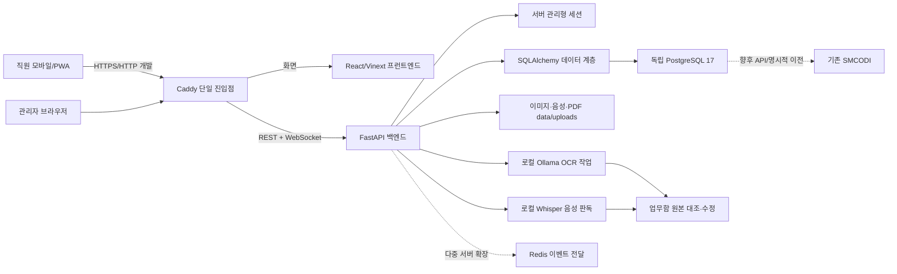

# 시스템 구조

## 경계

- 화면은 권한을 표시하지만 최종 권한판정은 항상 백엔드가 수행한다.
- 프런트엔드는 직원·메시지의 영구 원본을 브라우저 저장소에 두지 않는다.
- 현재 WebSocket 연결목록은 한 백엔드 프로세스 메모리에만 있다.
- 개발 Docker에서는 백엔드와 프런트엔드 포트를 외부에 직접 공개하지 않고 Caddy `8080`만 공개한다.
- SilverHome 운영안은 Caddy의 `80/443`만 공개하고 DB·백엔드·프런트엔드는 Docker 내부망에 둔다.
- SMCODI와 테이블 명명·식별자 원칙은 맞추되 DB 접속과 스키마는 분리한다.
- 보고서 이미지는 채팅 저장·전달을 먼저 끝낸 뒤 로컬 OCR을 백그라운드에서 실행한다. OCR 실패가 채팅 전송 실패로 이어지지 않는다.
- 음성파일도 채팅 저장을 먼저 끝낸 뒤 현재 PC의 로컬 Whisper 서비스에서 판독한다. 판독 실패·오인식은 원본 메시지와 파일을 바꾸지 않는다.
- 로컬 Whisper 서비스는 호스트 PC에서 실행하고 Docker 백엔드는 `host.docker.internal`로 접근한다. 공유토큰은 `.env`에만 둔다.
- Docker의 첨부파일 경로는 `/data/uploads`로 고정하고 호스트 `data` 볼륨에 보존한다.

## 환경 분리

- 개발: React `3100`, FastAPI `8000`
- 컨테이너 시험: Caddy `8080`
- 정식 운영 준비: `chat.silvermedical.kr`, 자동 HTTPS, `COOKIE_SECURE=true`, HTTPS 출처 제한, 개발자 런처 비활성, 별도 비밀관리, `AUTO_CREATE_SCHEMA=false`
- 실제 서버 생성과 DNS 연결은 아직 하지 않았다.
