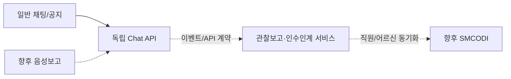

# SILVERMEDICAL.KR·향후 통합계획

## 도메인

- 채팅 운영 주소: `chat.silvermedical.kr`
- `staff.silvermedical.kr`은 향후 통합 직원앱 후보로 남긴다.
- `deploy/Caddyfile.production`과 `docker-compose.production.yml`까지 준비했다.
- 현재 `chat.silvermedical.kr`은 SilverHome 이전 전까지 사무실 PC의
  Cloudflare Tunnel `smcodi-chat-office-pc`에 임시 연결한다.
- 기존 공개 홈페이지와 기존 `silvermedical-homepage` 터널은 변경하지 않았다.
- 새 터널은 현재 PC의 `127.0.0.1:8080`만 바라보며 외부 인바운드 포트를 열지 않는다.
- SilverHome 운영 단계에서는 현재 PC 터널을 중지하고 서버용 커넥터·백업·복구·안전점검을 다시 검증한다.

## 접근원칙

- 공개 홈페이지 인증과 직원 인증 분리
- 직원계정과 재직상태 서버측 확인
- 검색엔진 비노출
- 백엔드·DB 포트 직접 노출 금지
- 방화벽·리버스프록시·HTTPS
- 외부 호스트에서 개발자 사용자 전환 런처 차단
- Cloudflare 토큰·비밀번호·세션키의 Git·문서·화면 노출 금지

## 관찰보고·인수인계 확장점

- 메시지 유형과 `recipient_id`, `metadata_json`
- 사진 메타데이터 `attachments`와 원본 파일의 분리 이전
- `staff_hub_processing_items`의 원문·AI 제안·담당자 확정 단계
- 실제 AI 제공자는 향후 별도 작업자로 연결하고, `prototype-rule-v1` 결과와 제공자·모델·프롬프트 버전을 구분
- 확정 결과만 문서 후보 API로 전달하며 원문과 AI 제안을 함께 추적 가능하게 유지
- 일반 메시지를 인수인계 후보로 전환하는 별도 API
- 직원·어르신 UUID의 API 동기화 또는 명시적 이전
- 상태: 확인대기 → 확인 → 처리중 → 완료
- 서비스 간 이벤트의 멱등키·재처리·감사기록

실제 통합방식과 공통인증은 현재 확정하지 않는다.

## `SMCODI 서류 필드·연동 API`의 구체적 의미

- **서류 필드**는 SMCODI 실제 입력화면의 칸을 뜻한다. 예: 어르신 식별값, 서비스 일자·시간, 기록 분류, 관찰내용, 시행한 조치, 반응·결과, 작성자, 승인자.
- **연동 API**는 MESIL_Chat에서 사람이 승인한 초안을 SMCODI의 해당 입력칸으로 안전하게 넘기는 서비스 간 전송 창구다. SMCODI 데이터베이스에 직접 쓰는 방식은 사용하지 않는다.
- 실제 연동 전에 급여제공기록지·간호일지·상담일지의 빈 화면 또는 가명 입력화면을 읽기 전용으로 확인해 `MESIL_Chat 초안 필드 → SMCODI 입력 필드` 대응표를 확정한다.
- 이후 SMCODI 측이 승인 초안을 받는 API를 제공하면 문서 종류, 어르신 UUID, 기준일, 승인자, 승인본문, 원문 추적 ID, 중복방지 키를 전달한다.
- 현재 단계에서는 SMCODI 프로젝트·DB·입력화면을 수정하지 않았고 실제 서류 자동등록도 수행하지 않는다.

## 당일서류와 주기서류의 분리

- 당일 작성 대상: 급여제공기록지, 간호일지, 상담일지, 신체제재 기록지, 프로그램 운영기록지.
- 주기 작성 대상: 통합사정, 급여제공계획, 급여제공결과평가, 낙상위험도, 욕창위험도, 인지기능, 욕구사정.
- 주기서류는 개별 사건마다 생성하지 않고, 담당자가 어르신과 조회기간을 선택할 때 확정된 기록을 모아 근거자료와 초안을 생성한다.
- 현재 기관 기준 기본 조회주기는 6개월로 두되 코드에 법정 고정값으로 박지 않고 관리자가 변경할 수 있는 설정값으로 설계한다. 실제 작성주기와 평가기준은 운영 시점의 기관 기준·최신 지침을 다시 확인한다.
- 낙상·욕창·인지 평가는 점수를 자동 확정하지 않고 점검이 필요한 근거와 관련 기록만 제시한다.

## 손글씨 사진 OCR 현재 구현과 확장안

채팅 전송은 사진과 메시지를 먼저 저장·전달하고 OCR은 별도 백그라운드 작업으로 실행한다.

`사진 원본 저장 → OCR 원문 후보 → 낮은 신뢰도 표시 → 담당자 대조·수정 → 구조화 제안 → 담당자 확정 → 서류 후보`

- 현재 동작 모델: 로컬 Ollama `qwen3-vl:8b-instruct`. 생각형 모델의 출력 소진을 피하고, 세로 보고서 사진은 3구간으로 나눠 8,192 문맥·최대 4,096 출력으로 RTX 5080에서 실행한다.
- 실제 손글씨 3장 예비시험에서 12.68~15.46초 안에 결과를 생성하고 반복행을 제거했지만 성명·숫자·일부 단어 오인식은 남았다. 자동 공식기록 전환은 허용하지 않는다.
- 카카오톡 내보내기 원문은 저장소에 복사하지 않고 로컬 철자 후보 파일만 만들며 해당 파일도 Git에서 제외한다. 자동 교정은 하지 않고 유사 철자를 업무함에 후보로만 표시한다.
- 다음 비교 후보: 한국어를 지원하는 [Nemotron OCR v2 다국어판](https://huggingface.co/nvidia/nemotron-ocr-v2)과 PaddleOCR 한국어 모델을 실제 가명 손글씨로 비교
- Nemotron Nano VL 12B는 일반 시각언어모델이라 초기 전용 OCR로 채택하지 않았다. 사진 내용과 표·문맥을 이해하는 2차 보정·분류 후보로 둔다.
- 손글씨 숫자·날짜·성명·투약 관련 오인식은 위험도가 높으므로 반드시 원본 사진과 나란히 사람이 확인
- 외부 클라우드 OCR은 실제 개인정보를 기본 전송하지 않으며, 필요 시 비식별 가명 표본으로만 별도 승인 시험
- 비교지표: 글자 오류율, 누락 행, 숫자·날짜 오류, 처리시간, GPU 메모리, 낮은 신뢰도 검출률
